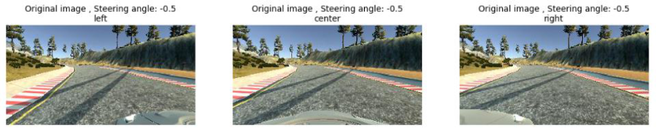
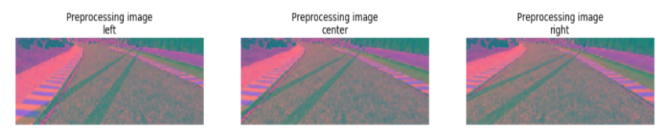
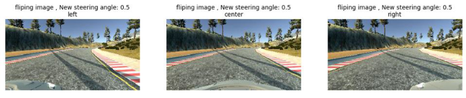
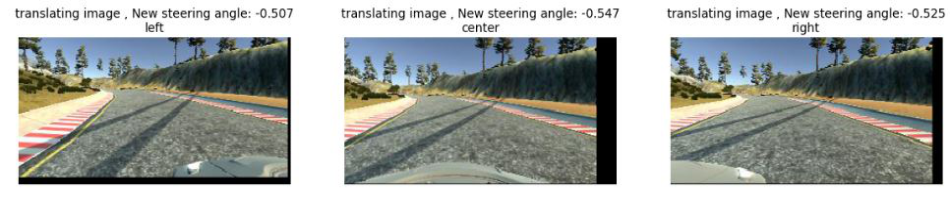
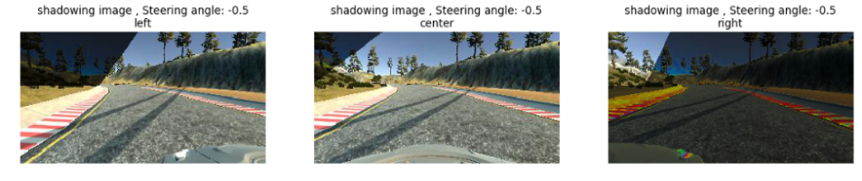
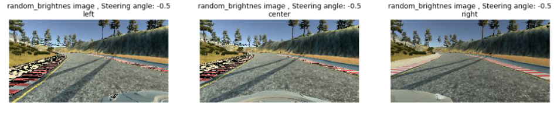
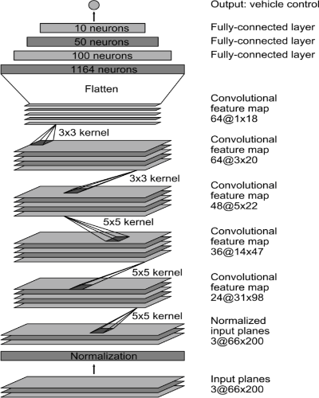

# Cloning Driver Behavior for Self-Driving Cars

<p align="center"></p>

# Overview
**Cloning Driver Behavior for Self-Driving Cars** is a project in which a deep neural network model was used to teach the car to drive itself by collecting driving data using the [Udacity's Car Simulator](https://github.com/udacity/self-driving-car-sim) and using [The PilotNet NVIDIA model](https://devblogs.nvidia.com/parallelforall/deep-learning-self-driving-cars/) to train the data.
### Files included
- model.py: The script used to create and train the model.
- drive.py: The script used to drive the car in autonomous mode. 
- utils.py: The script used to provide some image preprocessing and augumentation functions.
- model.h5: The generated file from training which contains the resulting wights.
- environments.yml: conda environment (Used to generate new conda enviroment to run the project with tensorflow-cpu)
- environments-gpu.yml: conda environment (Used to generate new conda enviroment to run the project with tensorflow-gpu)
- data_exploring_notebook.ipynb:  notebook for exploring the data.

Note: drive.py is originally from the [Udacity Behavioral Cloning project](https://github.com/udacity/CarND-Behavioral-Cloning-P3) but it has been slightly modified.

# Software dependencies
The environments.yml or environments-gpu.yml file contains all required dependencies for the code to run. If we open .yml file using notebad we can read it to check if the dependencies available or not. If not available we can install it manually using the command ```pip install``` or ```conda install``` if we have installed conda. The other choice to run the code is creating a new conda enviroment using the command ```conda env create -f environments.yml ```(tensorflow-cpu) or ```conda env create -f environments-gpu.yml```(tensorflow-gpu). To create the enviroment we need [anaconda](https://www.continuum.io/downloads) or [miniconda](https://conda.io/miniconda.html) to be installed.

After preparing the python enviroment for the project we need to install the [Udacity's Car Simulator](https://github.com/udacity/self-driving-car-sim) to train the data and test the model.
 
# Generate training data
The simulator is used to generate the training data.  The simulator has two modes training and autonomous. In the "training mode" the car can be controlled through a keyboard or joystick to generate training data. After pressing the record button on the right of the simulator window, it begins to collect data. The collected data consist of images captured by three cameras (left, center,  right) mounted on the car and corresponding steering angle, throttle and speed. after ending training a new folder 'IMG' and 'driving_log.csv' file are generated. The 'driving_log.csv' file consists of 7 columns ['center', 'left', 'right', 'steering', 'throttle', 'reverse', 'speed'] the first three hold the directory of center, left and right images and the later 4 hold steering, throttle, reverse, speed values.

samples from generated images.

|  |  | | 
| ---------------------------------------- | ---------------------------------------- | ---------------------------------------- |
| **Left**                                 | **Center**                               | **Right**                                |

# Model

### Data Preprocessing

In Preprocessing 3 functions are applied to the image ( crop, resize, rgb2yuv). The crop function removes unnecessary parts from the image like the sky and the front part of the car as they hold no information. The resize function resizes the image to the input shape used by the network model (66, 200). The rgb2yuv converts the image from RGB to YUV (This is what the NVIDIA model does).

samples from preprocessed images:

<p align="center"></p>
<p align="center"></p>

 ### Data Augmentation
 
The data augmentation is done by applaying 4 functions randomly to the images the 4 functions are:

**random_flip** : Flipping the copies of image horizontally, and negating the steering angles. this function tries to add some                     balance to the steering_angle distribution.

**random_translate** : Randomly translate image with steering angle adjustment (0.002 per pixel shift).

**random_shadow** : Randomly added shadows to fit diffrent conditions.

**random_brightness** : Randomly change brightness to fit diffrent conditions (lighter or darker).

samples from augmented images:

<p align="center"></p>
<p align="center"></p>
<p align="center"></p>
<p align="center"></p>

### Model architecture

The figure below shows the used CNN model architecture for training ([Source](https://devblogs.nvidia.com/deep-learning-self-driving-cars/)).

<p align="center"></p>

The model Summary:

**Layer_0:**  Image normalization to avoid saturation and make gradients work better.

**Layer_1:**    Convolution: 5x5, filter: 24, strides: 2x2, activation: ELU.

**Layer_2:**    Convolution: 5x5, filter: 36, strides: 2x2, activation: ELU.

**Layer_3:**    Convolution: 5x5, filter: 48, strides: 2x2, activation: ELU.

**Layer_4:**    Convolution: 3x3, filter: 64, strides: 1x1, activation: ELU.

**Layer_5:**    Convolution: 3x3, filter: 64, strides: 1x1, activation: ELU.

**Drop out (0.5)**   default value

**Fully connected:**   neurons: 100, activation: ELU.

**Fully connected:**   neurons: 50, activation: ELU.

**Fully connected:**   neurons: 10, activation: ELU.

**Fully connected:**   neurons: 1 (output).

# Training

The model was trained on windows machine with NVIDIA GeForce 920M GPU by running the command ```python model.py -d data -t 0.2 -k 0.7 -n 5 -s 25000 -o False```. The parsed parameters are (-d) data directory which contains driving_log.csv file (the default value is data so to used the default we need to creat new folder with name "data" in the current directory and store "driving_log.csv" file inside it), (-t) test size fraction: 0.2, (-k) drop out probability: 0.7, (-n) number of epochs: 5, (-s) samples per epoch: 25000 and (-o) save best models only: False. The other parameters assigned to the default values.

# Result

By running ```drive.py``` script, The model could successfully drive the car on the track. The video below shows the result.

 <p align="center"><a href="https://www.youtube.com/watch?v=JI-xxoZxkRU"></a></p> 
 
# Installtion

After downloading the required dependencies that mentioned in "software dependencies" section. we can now download the project through this git commands:

```sh
git clone https://github.com/maidaly/Cloning-Driver-Behavior-for-SelfDriving-Car.git
cd Cloning-Driver-Behavior-for-SelfDriving-Car
```
**Usage**

- For creating new model we can run the command ``` python model.py ``` after creating the training data using the simulator on the training mode.

- For driving using the model in the repo we can run the command ``` python drive.py model.h5 ``` and adjusting the simulator to be on the autonomous mode.

# References: 

[1]  M. Bojarski, B. Firner, B. Flepp, L. Jackel, U. Muller, K. Zieba and D. Del Testa,  'End-to-End Deep Learning for Self-Driving Cars'  *NVIDIA Developer Blog* 2016  [Online]. Available: https://devblogs.nvidia.com/deep-learning-self-driving-cars/

[2] Udacity, 'Behavioral Cloning Project'  [Online]. Available: https://github.com/udacity/CarND-Behavioral-Cloning-P3
'


