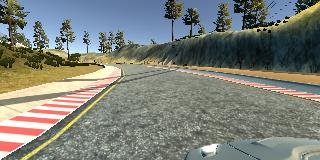
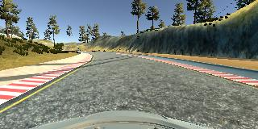
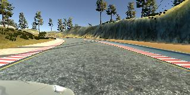

# Cloning Driver Behavior for Self-Driving Cars

<p align="center"></p>

# Overview
**Cloning Driver Behavior for Self-Driving Cars** is a project in which i used a deep neural network model to teach the car to drive itself by collecting driving data using the [Udacity's Car Simulator](https://github.com/udacity/self-driving-car-sim) and using [The PilotNet NVIDIA model](https://devblogs.nvidia.com/parallelforall/deep-learning-self-driving-cars/) to train the data.
### Files included
- model.py: The script used to create and train the model.
- drive.py: The script used to drive the car in autonomous mode. 
- utils.py: The script used to provide some image preprocessing and augumentation functions.
- model.h5: The generated file from training which contains the resulting wights.
- environments.yml: conda environment (Used to generate new conda enviroment to run the project with tensorflow-cpu)
- environments-gpu.yml: conda environment (Used to generate new conda enviroment to run the project with tensorflow-gpu)

Note: drive.py is originally from the [Udacity Behavioral Cloning project](https://github.com/udacity/CarND-Behavioral-Cloning-P3) but it has been slightly modified.

# Install dependencies
The environments.yml or environments-gpu.yml file contains all required dependencies for the code to run. If we open .yml file using notebad we can read it to check if we have this dependencies or not. If we have most of them we can install the rest by ```pip install``` or ```conda install``` if we have installed conda. The other choice is create a new conda enviroment to run the code 


# Generate training data
The simulator is used to generate the training data.  The simulator has two modes training and autonomous. In the "training mode" the car can be controlled through a keyboard to generate training data. After pressing the record button on the right the simulator starts to collect data. The collected data consists of images captured by three cameras (left, center,  right) mounted on the car and corresponding steering angle, throttle and speed. after ending training a new folder 'IMG' and 'driving_log.csv' file are generated. The 'driving_log.csv' file consists of 7 columns ['center', 'left', 'right', 'steering', 'throttle', 'reverse', 'speed'] the first three hold the directory of center, left and right images and the later 4 hold steering, throttle, reverse, speed values.

samples from generated images.

|  |  | | 
| ---------------------------------------- | ---------------------------------------- | ---------------------------------------- |
| **Left**                                 | **Center**                               | **Right**                                |

